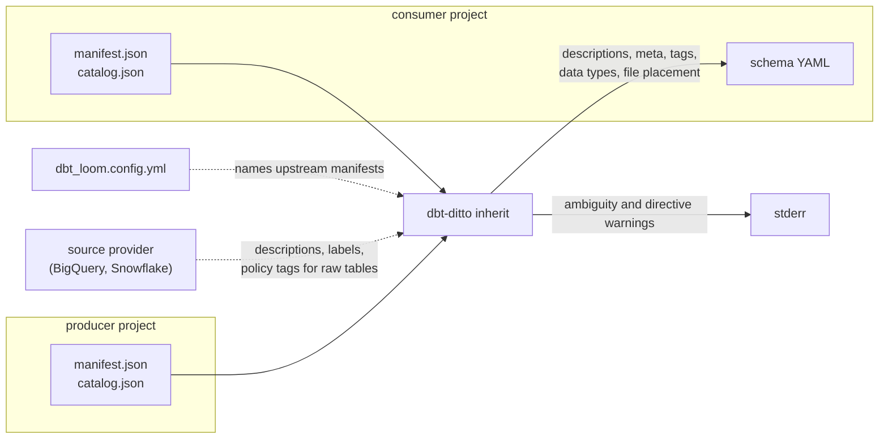

# dbt-ditto

[](https://github.com/rognerud/dbt-ditto/actions/workflows/ci.yml)


*same as above*. dbt-ditto propagates column documentation
down the dbt graph and writes it back into the schema YAML files. 
It is a single static Go binary with two pure-Go dependencies
(`gopkg.in/yaml.v3`, `github.com/BurntSushi/toml`): 
it reads the `manifest.json` and `catalog.json` dbt has already written, so it needs no dbt, no Python and no
warehouse connection.



## Status

Active, pre-1.0.

## Points of contact

| | |
|---|---|
| Contact | [GitHub issues](https://github.com/rognerud/dbt-ditto/issues) |

## What it does

Reads the dbt artifacts, resolves what each column's
documentation should be after inheritance, and edits the schema YAML in place —
preserving comments and key order.

- **Inheritance across project boundaries**, for projects that use dbt-loom. This
  does *not* replace loom: injecting upstream nodes so a cross-project `ref()`
  compiles is still loom's job at dbt runtime. dbt-ditto runs afterwards, over
  artifacts on disk, and reads an existing `dbt_loom.config.yml` so the upstream
  list is not maintained twice.
- **Documentation for source tables**, which inheritance alone can never reach:
  warehouse `COMMENT`s from the catalog, optional backfill from the staging
  model downstream, and optional **source providers** that ask the warehouse
  directly — descriptions, labels, tags and policy tags for the raw tables no
  dbt project builds. Providers are separate programs, so the binary gains no
  dependency and still connects to nothing; they reuse dbt's own `profiles.yml`,
  so there is no second copy of a credential. BigQuery and Snowflake ship in
  [`packaging/providers/`](packaging/providers/README.md).
- **Explicit directives** (`description: "Inherited: stg_customers.customer_id"`)
  for columns that were renamed, where no heuristic should be trusted to guess.
- **A `--check` mode** that fails without writing, for CI.
- **dbt-osmosis' YAML management, reproduced byte for byte.** Column sync against
  the warehouse catalog, description / meta / tag inheritance, and schema-file
  organisation from `+dbt-osmosis:` path templates. Existing configuration is read
  as-is; there is no migration.

```sh
dbt-ditto inherit path/to/project
```

It never re-parses the project, so it is roughly an order of magnitude faster
than dbt-osmosis — [docs/development.md](docs/development.md#speed) has the
benchmark and how to run it.

## Configuration

There need not be any. Schema-file placement is read from `+dbt-ditto-path:` /
`+dbt-osmosis:` in `dbt_project.yml` or a model's own `config()` block, and
upstream manifests from `dbt_loom.config.yml` — both where dbt already keeps
them. `dbt-ditto inherit path/to/project` runs on those alone.

Anything beyond that goes in `dbt_ditto.yml` or a `[tool.dbt-ditto]` table in
`pyproject.toml`, found by searching upwards from the working directory.
[docs/usage.md](docs/usage.md#settings) tables every key with its default, and
[`internal/config/config.go`](internal/config/config.go) is the source of truth.

## Observability

- Everything goes to the terminal: the summary and the list of files on stdout,
  warnings on stderr. Nothing is shipped anywhere.
- A run succeeded if it exits `0`; `--check` exits non-zero when documentation is
  out of date, which is the signal CI should gate on.
- No metrics. It is a short-lived command, so there is nothing to scrape — use
  the exit code and the run output.

## Scope of reuse

Meant to be used by any dbt project, not just this repository's own: it is
published as a PyPI wheel carrying the binary (`uv add dbt-ditto`) and as a Go
module. Configuration is read from `dbt_ditto.yml`, and from the
`+dbt-osmosis:` rules a project already has. Support is best-effort via GitHub
issues.

## More documentation

- [docs/usage.md](docs/usage.md) — install, configuration reference,
  cross-project inheritance, source documentation, directives, and how
  inheritance resolves.
- [docs/development.md](docs/development.md) — build, test, the parity
  proof against the real dbt-osmosis, the dbt-version and adapter matrix,
  benchmarks, CI and packaging.
- [docs/source-providers.md](docs/source-providers.md) — the source provider
  contract, label routing and propagation rules.
- [AGENTS.md](AGENTS.md) — architecture, conventions, and the traps that are not
  obvious from the code.

## License

MIT — see [LICENSE](LICENSE).
