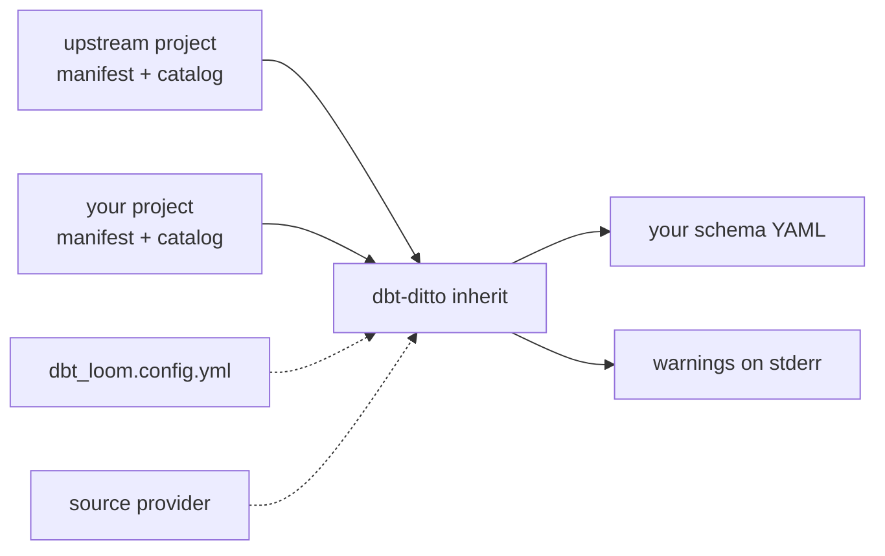

#  dbt-ditto

[](https://github.com/rognerud/dbt-ditto/actions/workflows/ci.yml)


*same as above.* dbt-ditto propagates column documentation down the dbt graph and
writes it back into your schema YAML. It reads the `manifest.json` and
`catalog.json` dbt already wrote, so it needs no dbt, no Python and no warehouse
connection — a single static Go binary.

```sh
uv add dbt-ditto                 # or: pip install dbt-ditto
dbt-ditto inherit path/to/project
```

## What it does

- **Inherits descriptions, meta and tags** down the DAG, and syncs the column
  list, data types and schema-file placement against the catalog.
- **Reproduces dbt-osmosis byte for byte**, reading your existing
  `+dbt-osmosis:` path templates as-is. No migration.
- **Crosses project boundaries** for dbt-loom setups, reading
  `dbt_loom.config.yml` so the upstream list is not maintained twice. It does not
  replace loom: loom injects nodes at dbt runtime, ditto runs afterwards over
  artifacts on disk.
- **Documents source tables**, which inheritance can never reach, from warehouse
  comments, backfill from downstream, or [source
  providers](docs/source-providers.md) that ask the warehouse directly.
- **Takes explicit instructions** for renamed columns, and has a `--check` mode
  that fails CI on stale documentation without writing.

An order of magnitude faster than dbt-osmosis, never re-parsing the project
([benchmark](CONTRIBUTING.md#speed)).



Active, pre-1.0. Support is best-effort via [GitHub
issues](https://github.com/rognerud/dbt-ditto/issues).

## Documentation

**Using it**

- [docs/usage.md](docs/usage.md) — install, run, and every task it does.
- [docs/configuration.md](docs/configuration.md) — every setting and default.
- [docs/source-providers.md](docs/source-providers.md) — raw tables from the
  warehouse.

**Working on it**

- [CONTRIBUTING.md](CONTRIBUTING.md) — build, test, parity proof, release.
- [AGENTS.md](AGENTS.md) — architecture, internals, traps.

## License

MIT — see [LICENSE](LICENSE).
