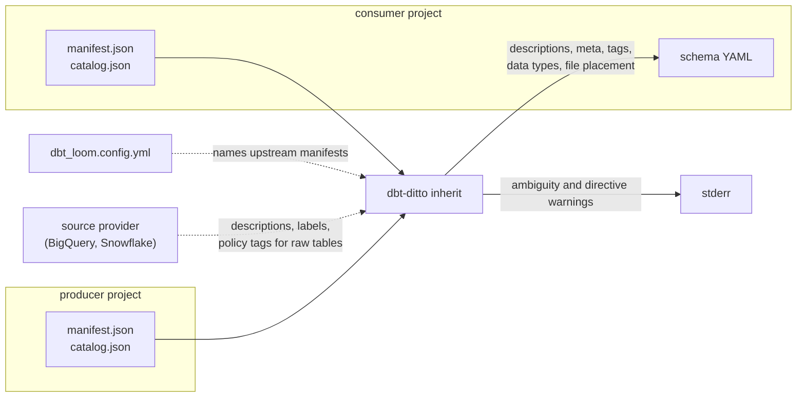

# dbt-ditto

[](https://github.com/rognerud/dbt-ditto/actions/workflows/ci.yml)


*same as above*. dbt-ditto propagates column documentation
down the dbt graph and writes it back into the schema YAML files. 
It is a single static Go binary with two pure-Go dependencies
(`gopkg.in/yaml.v3`, `github.com/BurntSushi/toml`): 
it reads the `manifest.json` and `catalog.json` dbt has already written, so it needs no dbt, no Python and no
warehouse connection.



## Status

Active, pre-1.0.

## Points of contact

| | |
|---|---|
| Contact | [GitHub issues](https://github.com/rognerud/dbt-ditto/issues) |

## What it does

Reads the dbt artifacts, resolves what each column's
documentation should be after inheritance, and edits the schema YAML in place —
preserving comments and key order.

- **Inheritance across project boundaries**, for projects that use dbt-loom. This
  does *not* replace loom: injecting upstream nodes so a cross-project `ref()`
  compiles is still loom's job at dbt runtime. dbt-ditto runs afterwards, over
  artifacts on disk, and reads an existing `dbt_loom.config.yml` so the upstream
  list is not maintained twice.
- **Documentation for source tables**, which inheritance alone can never reach:
  warehouse `COMMENT`s from the catalog, optional backfill from the staging
  model downstream, and optional **source providers** that ask the warehouse
  directly — descriptions, labels, tags and policy tags for the raw tables no
  dbt project builds. Providers are separate programs, so the binary gains no
  dependency and still connects to nothing; they reuse dbt's own `profiles.yml`,
  so there is no second copy of a credential. BigQuery and Snowflake ship in
  [`packaging/providers/`](packaging/providers/README.md).
- **Explicit directives** (`description: "Inherited: stg_customers.customer_id"`)
  for columns that were renamed, where no heuristic should be trusted to guess.
- **A `--check` mode** that fails without writing, for CI.
- **dbt-osmosis' YAML management, reproduced byte for byte.** Column sync against
  the warehouse catalog, description / meta / tag inheritance, and schema-file
  organisation from `+dbt-osmosis:` path templates. Existing configuration is read
  as-is; there is no migration.

```sh
dbt-ditto inherit path/to/project
```

It is really fast, approximately 50x faster than dbt-osmosis, because it never re-parses
the project.

## Where configuration lives

Searched for in the working directory and then each parent, first hit winning:
`dbt_ditto.yml`, `dbt_ditto.yaml`, `.dbt_ditto.yml`, then `pyproject.toml` — the
last only if it has a `[tool.dbt-ditto]` table.

```toml
[tool.dbt-ditto]
loom = true

[[tool.dbt-ditto.projects]]
path = "projects/platform"

[tool.dbt-ditto.inheritance]
progenitor = true
ambiguity_meta = true
```

Two more things are read from where dbt already keeps them, with no dbt-ditto
config at all: schema-file placement from `+dbt-ditto-path:` / `+dbt-osmosis:` in
`dbt_project.yml` or a model's own `config()` block, and upstream manifests from
`dbt_loom.config.yml`. `dbt-ditto inherit path/to/project` runs on those alone.

## Settling an argument: `dbt_ditto_definitive`
Some times you just need to set the record straight.

```yaml
columns:
  - name: customer_id
    description: The account the order was placed under.
    meta:
      dbt_ditto_definitive: true
```

Every column called `customer_id` anywhere in the run now says that — upstream,
downstream and in the other projects, because a decision is not a direction. The
declaring column is locked: nothing overwrites it, not an ancestor, not `force`,
not a directive. Columns that take the wording record where it came from in
`osmosis_progenitor`, and the ambiguity warning stops, because nothing is
arbitrary any more.

Two rules keep it honest:

- **Two declarations that disagree stop the run**, naming both and what each
  says. Picking between them by rule is precisely what the marker exists to
  avoid. Identical wording declared twice is one decision, not a conflict. If
  `case_insensitive` is on, `ID` and `id` are the same column and the error says
  so.
- **Declarations in a manifest-only upstream are ignored.** A dbt-loom manifest
  cannot be read, reviewed or edited from this repository, so it does not get to
  rewrite documentation here.

The key name is fixed. It is a contract between projects that may be in
different repositories, and a contract each side spells differently is not one.

## Settings

Every key, with its default — as YAML in `dbt_ditto.yml`, or under
`[tool.dbt-ditto]` in `pyproject.toml`. Defaults reproduce dbt-osmosis, except
`inheritance.progenitor`. Each row is enforced by a test that runs the tool twice
and checks the described difference actually appears
([`internal/runner/settings_test.go`](internal/runner/settings_test.go)).

**Which projects take part**

| Key | Default | Change it to… |
| --- | --- | --- |
| `projects[].path` | — | point at a dbt project directory — the one holding `dbt_project.yml`. Relative paths are resolved against the config file |
| `projects[].target` | `<path>/target` | read `manifest.json` / `catalog.json` from somewhere else, e.g. a directory CI downloaded them into |
| `projects[].manifest` | — | add an upstream that is only a `manifest.json(.gz)`, with no checkout. Always read-only |
| `projects[].upstream` | `false` | take documentation *from* this project but never write its YAML |
| `loom` | `true` | set `false` to ignore `dbt_loom.config.yml`. When on, its `type: file` manifests are loaded as upstreams |

**What travels between columns**

| Key | Default | Change it to… |
| --- | --- | --- |
| `inheritance.columns` | `true` | set `false` to stop inheriting altogether, leaving only column sync and file organisation |
| `inheritance.node_description` | `false` | set `true` to give a model the description of the model above it, not just its columns' |
| `inheritance.meta` | `true` | set `false` to leave `meta` alone; on, an ancestor's keys are merged in and win collisions |
| `inheritance.tags` | `true` | set `false` to leave `tags` alone; on, ancestors' tags are added to the column's own |
| `inheritance.case_insensitive` | `true` | set `false` to stop `ID` matching an upstream `id`, e.g. on Snowflake |
| `inheritance.force` | `false` | set `true` to replace descriptions already written by hand. Off, a documented column is never touched |
| `inheritance.placeholders` | dbt-osmosis' list | replace the wordings that count as "not really documented" upstream, and so do not get inherited |
| `inheritance.skip_meta_keys` | none | name meta keys that must stay put — `owner` on an upstream table is about that table |
| `inheritance.backfill.enabled` | `false` | set `true` to document a column from the models *below* it, which is the only way to reach a source |
| `inheritance.backfill.sources_only` | `true` | set `false` to backfill models as well, letting a mart's wording flow back up into what feeds it |
| `inheritance.derived.enabled` | `false` | set `true` to follow a column through a rename — `sum(amount_cents) as total_amount_cents` keeps the documentation |
| `inheritance.derived.structs` | `true` | set `false` to stop matching `profile.first_name` to a flat `first_name`, and the reverse |
| `inheritance.derived.aggregates` | `true` | set `false` to stop matching `total_amount_cents` to `amount_cents` |
| `inheritance.derived.prefixes` | `sum`, `total`, `avg`, … | replace the words stripped from the front of a name before matching |
| `inheritance.derived.suffixes` | `sum`, `count`, `cnt`, … | replace the words stripped from the end. Dropping `count` stops `order_id_count` inheriting from `order_id` |

**Pointing at an answer, and recording where it came from**

| Key | Default | Change it to… |
| --- | --- | --- |
| `inheritance.directives` | `true` | set `false` to treat `description: "Inherited: stg_customers.customer_id"` as ordinary prose instead of a pointer |
| `inheritance.directive_prefix` | `Inherited:` | change the marker that makes a description a pointer |
| `inheritance.progenitor` | `true` | set `false` for byte parity with dbt-osmosis. On, an inherited description records the node it came from |
| `inheritance.progenitor_key` | `osmosis_progenitor` | rename that meta key |
| `inheritance.warn_ambiguous` | `true` | set `false` to stop reporting columns whose parents disagree, where the winner is decided by `unique_id` order |
| `inheritance.ambiguity_meta` | `false` | set `true` to record that disagreement in the column's meta, where it stays after the warning has scrolled away |
| `inheritance.ambiguity_key` | `dbt_ditto_ambiguous` | rename that meta key |

**What the column list looks like afterwards**

| Key | Default | Change it to… |
| --- | --- | --- |
| `columns.add_missing` | `true` | set `false` to leave the YAML's column list alone instead of adding what the warehouse has |
| `columns.remove_stale` | `true` | set `false` to keep columns the warehouse no longer reports |
| `columns.data_types` | `true` | set `false` to stop writing `data_type:` from the catalog |
| `columns.case` | `preserve` | `lower` or `upper` to re-case newly added column names. An already-written name is never churned |
| `columns.order` | `catalog` | `alphabetical`, or `yaml` to keep the order the file already has |
| `columns.expand_structs` | `true` | set `false` to document `profile` but not `profile.first_name`. On is what an adapter that understands nested data reports |
| `columns.comments` | `new` | `always` to fill any undocumented column from the warehouse `COMMENT`, `never` to ignore comments |
| `organize.enabled` | `true` | set `false` to leave every model in the file it is documented in today, ignoring `+dbt-ditto-path:` |
| `organize.delete_empty` | `true` | set `false` to leave behind a schema file whose last model moved out |
| `output.comments` | `follow` | `osmosis` to reproduce dbt-osmosis' loss of every YAML comment inside a column list except the first |

Whether meta and tags are nested under `config:` is **not** a setting: dbt ≥ 1.9.6
reads them there and older dbt does not read them there at all, so the manifest's
own dbt version decides it. Nor is a project's name, which is whatever
`dbt_project.yml` says and is what decides which nodes belong to it.

Command-line flags — `--check`, `--dry-run`, `--select`, `-c`, `--verbose`,
`--no-organize` — are listed by `dbt-ditto --help`.

## Observability

- Everything goes to the terminal: the summary and the list of files on stdout,
  warnings on stderr. Nothing is shipped anywhere.
- A run succeeded if it exits `0`; `--check` exits non-zero when documentation is
  out of date, which is the signal CI should gate on.
- No metrics. It is a short-lived command, so there is nothing to scrape — use
  the exit code and the run output.

## Scope of reuse

Meant to be used by any dbt project, not just this repository's own: it is
published as a PyPI wheel carrying the binary (`uv add dbt-ditto`), as a Go
module, and as a dbt package of run-operation macros under
`packaging/dbt-ditto/`. Configuration is read from `dbt_ditto.yml`, and from the
`+dbt-osmosis:` rules a project already has. Support is best-effort via GitHub
issues.

## More documentation

- [.agents/usage.md](.agents/usage.md) — install, configuration reference,
  cross-project inheritance, source documentation, directives, and how
  inheritance resolves.
- [.agents/development.md](.agents/development.md) — build, test, the parity
  proof against the real dbt-osmosis, the dbt-version and adapter matrix,
  benchmarks, CI and packaging.
- [AGENTS.md](AGENTS.md) — architecture, conventions, and the traps that are not
  obvious from the code.
- [packaging/dbt-ditto/README.md](packaging/dbt-ditto/README.md) — the dbt
  package.

## License

MIT — see [LICENSE](LICENSE).
